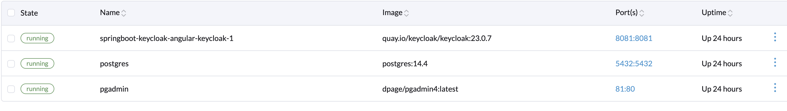
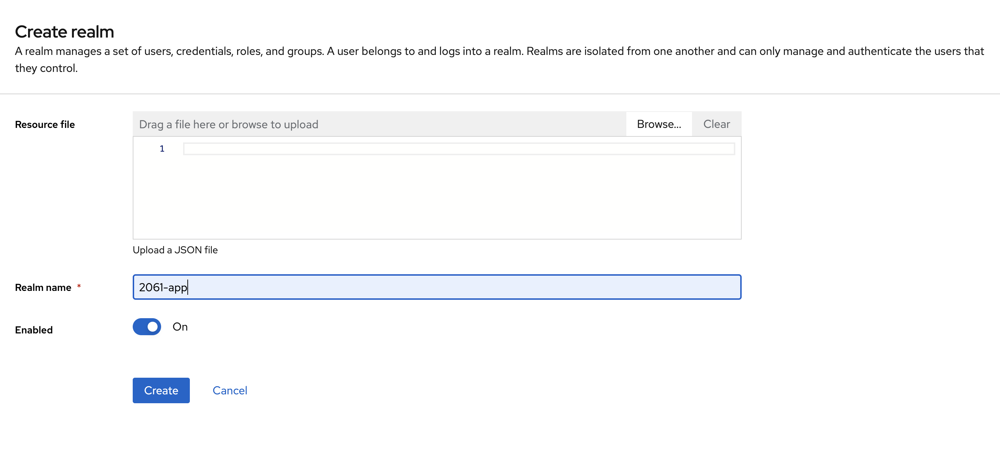
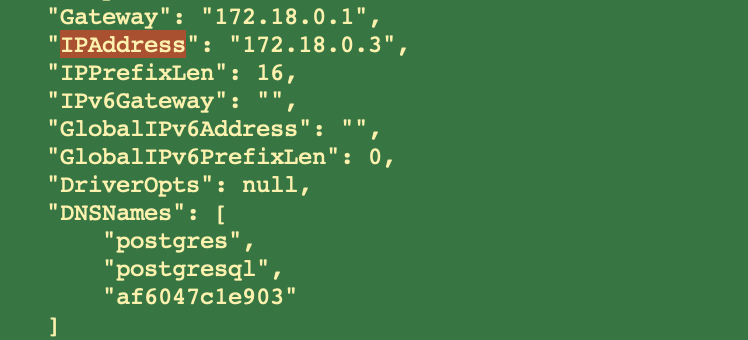
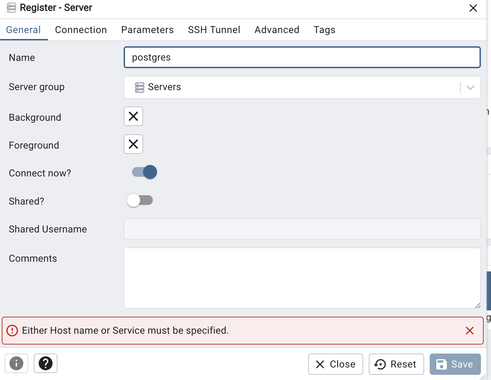
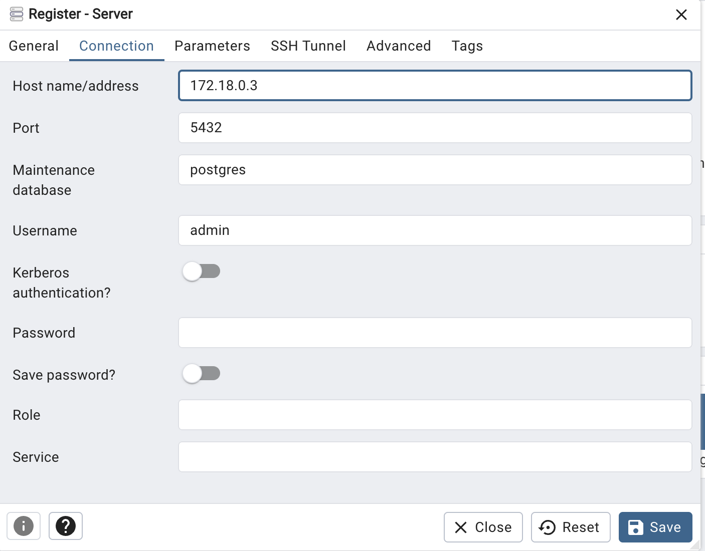
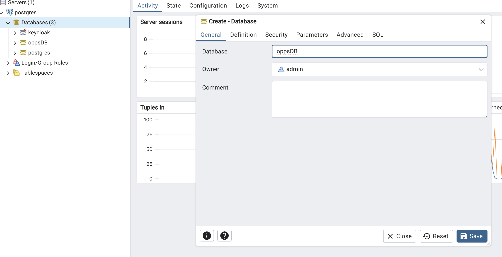

# Getting Started Prerequisites
## Install docker, for Mac use homebrew
    brew install --cask docker
## Install Rancher Desktop
  https://rancherdesktop.io/

# Tutorial

## 1. Deploying Keycloak + Postgres with Docker
Start docker with `docker compose up`.
> The docker compose will spin up 3 continers one for keycloak, one for postgres and one for pgadmin. The postgres will create a database for keycloak with the DB name as 'keycloak'


## 2. Keycloak - configuration

### 2.1. Creating a realm
Realm is a separate "container" for our application. It contains set of users, clients and global roles.<br/>
We can say **realm** represents our application infrastructure, which can have multiple **clients (e.g. backend and frontend)**.

1. Go to http://localhost:8081 -> administrator console and login with username and password: `admin`
2. Click upper top corner to create new realm. By default, you will only see `master`. 

3. Let's add new realm and call it `2061-app`. After clicking the `Create` button, a new realm will be created.<br/>

4. **Remember to perform all the operations in this new realm.**<br/>

### 2.2. Creating a client for backend (Spring Boot)
**Client** is a thing that will access data from our **realm**. For example a client can be **backend - Spring Boot** and/or **frontened - Angular**.

1. Go to `Clients -> Create client`<br/>

2. As we want to create a client for Spring Boot, populate `Client ID` with `backend` and smash next.<br/>

3. Select `Standard flow` and `Direct access grants`, because Spring Boot backend service **will only verify bearer token, it will never initiate the login**. Click save.<br/>

4. Now go to `Clients` and select our newly created `backend` client.<br/>
Find `Valid redirect URIs` and type `http://localhost:8080/*` (the Spring Boot url - remember to add `*`) and save.<br/>


### 2.3. Creating a client for frontend (Angular)
1. Go to `Clients -> Create client`<br/>

2. Fill in `Client ID` with `frontend`. Next.<br/>

3. Select `Standard flow`, `Direct access grants` and `Implicit flow`. <br/>

4. Now go to `Clients` and select our newly created `frontend` client.<br/>
Fill in `Valid redirect URIs` and `Valid post logout redirect URIs` with URIs you redirect after login/logout on frontend e.g. I used my local ip address. 
Fill in `Web origins` with `*` and save.<br/>


### 2.4. Creating `Roles`
We have 2 types of roles. Global (for every client) called `Realm roles`, and local `Client roles` available only for specific client.
In the tutorial we use only global roles - `Realm roles`.

1. Go to `Realm roles -> Create role` <br/>
2. Our role will be `user` <br/>


### 2.5. Enabling Registration
1. Go to `Realm settings -> Login`<br/>
2. Check `User registration` and `Email as username`<br/>


### 2.6. Making role to be added by default for every registered user
1. Go to `Realm settings -> User registration`<br/>
2. Click `Assign role`<br/>

3. Choose our role `user` and click `Assign`


Now every user registered using our Angular frontend will be automatically assigned to role `user`.

### 2.7. Creating 'test' users
I call it `test user`, because this user is created 'artificially', we will add a registration process later.

1. Go to `Users -> Add user`
2. Fill in `Email` and check `Email verified`.<br/>
Make sure `Required user actions` field is empty that we can start using this account without any further adjustments (e.g. first time log in password change, email confirmation etc.). Click create.<br/>

3. Go to `Users` and select newly create user.
Go to `Credentials tab` and add password by clicking `Set password`.<br/>
Make sure to uncheck `Temporary` and `Save`.<br/>

   
### 2.8. Adding roles to user
> This step is just to inform you, how to add role to user. We don't have to do that because our role `user` is automatically assigned for every user.

1. Go to `Users` and select newly create user.
2. Go to `Role mapping` tab

3. Click `Assign role`, choose your newly created role and hit `Assign`
(here some random created role `teacher`)


## 3. Spring Boot - configuration

### 3.1. Maven thing - *pom.xml*
We just need basci stuff (postgres, lombok and spring).<br/><br/>

### 3.2. Create the database for the application
> Remember to create database in postgres for the application. By default, docker compose creates database for Keycloak only. To do this purpose you can use `pgadmin`.
Access pgadmin using http://localhost:81/browser/
#### credentials
admin
admin
> You will then need to add the postgres server for the database that was created by the docker compose file, for which you will need to grab the IP address of the container.
### To get the IP address of postgres databse, use the following commands
docker ps
> this will list all the running containers, grab the conatiner ID of postgres and run

docker inspect <container id>


> grab the IP address from the Networks block
Use the IP address in the host field and use 'postgres' in the name field.





> In pgadmin create a new database 'oppsDB'


### 3.2. Compile the Springboot application
Either use STS or Visual Studio Code or your favorite IDE
Make sure to have lombok configured with your IDE to avoiad compilation errors

### 3.2. Run the Springboot application
The application should connect to the database but the APIs will not be accessible as it will need the auth token

## 4. Angular - configuration

### 4.1. Install dependencies if the existing version of keycloak throws error
```
npm install keycloak-angular --save 
npm install keycloak-js --save
```

### 4.2. Configure proxy to avoid any CORS policy
Every call made to `http://localhost:4200/api`, will be redirected to our Spring Boot application `http:localhost:8080`.

1. The file `proxy.conf.json` inside project directory has the following config
```json
{
  "/api": {
    "target": "http://localhost:8080",
    "secure": false,
    "pathRewrite": {"^/api" : ""}
  }
}
```

2. Check `package.json` for the following:
```
"start": "ng serve --proxy-config proxy.conf.json",
```

3. Config Keycloak using `enviroment`
The enviroment file should have the following:

*src/enviroments/enviroment.ts*
```typescript
export const environment = {
  production: false,
  apiUrl: '/api',
  keycloak: {
    // Keycloak url
    issuer: 'http://localhost:8081',
    // Realm
    realm: '2061-app',
    clientId: 'frontend'
  },
};
```

4. That's it
Start Angular using "ng serve --proxy-config proxy.conf.json".
Go to http://localhost:4200 and you sould see Keycloak login/register page.
